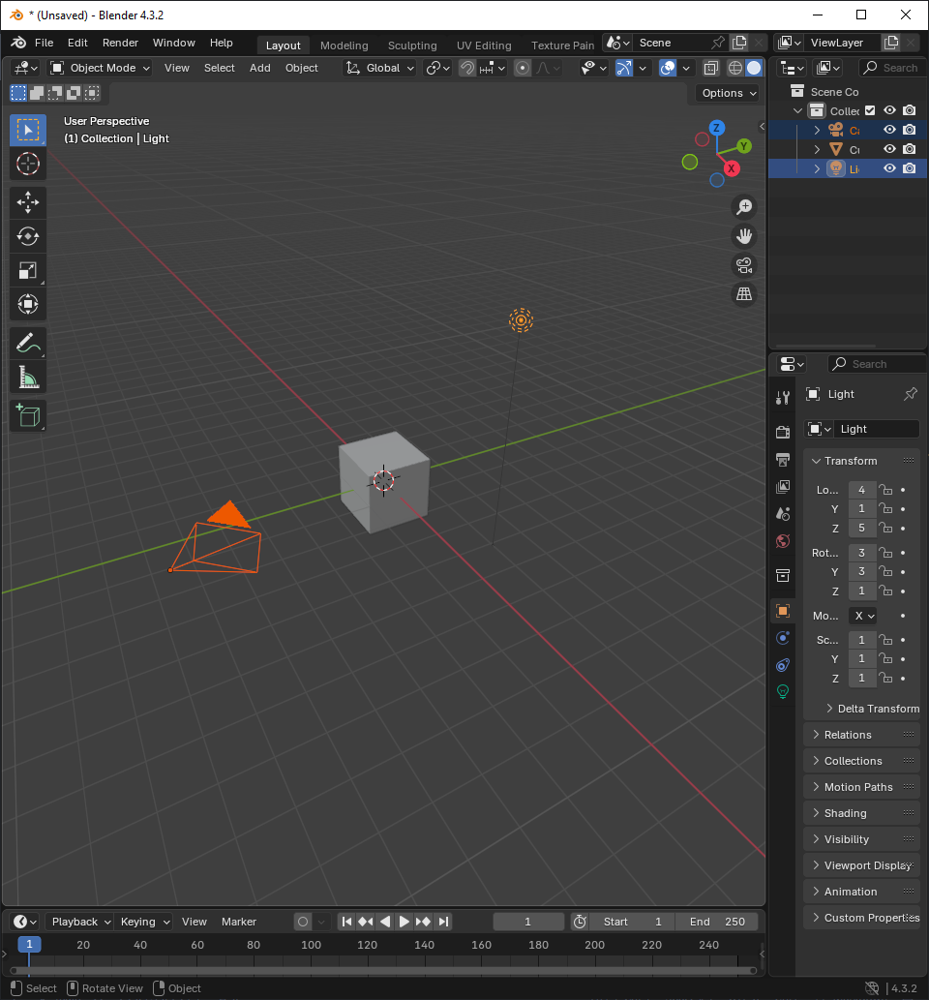

# Finding Reference Images    

Let's say we want to model a windmill. Many of our images will be copyrighted so we can use search terms like:
```
medieval windmill public domain
```

This gives us search results that look like this:
</br>
{ width="600" }
</br>

# Getting started 

So now let's start up/install blender. Blender is a free and open source application that can be installed via steam. Start it up and use:
```
left Mouse
Shift + Left Mouse  
```
On the camera and light then use `delete` to remove them:
</br>
{ width="600" }
</br>

We'll then change the `cubes` name to `windmill`  and save 

# Making the Central Tower 


