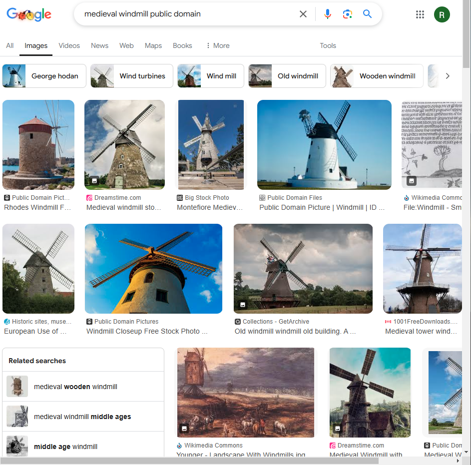

# Finding Reference Images    

Let's say we want to model a windmill. Many of our images will be copyrighted so we can use search terms like:
```
medieval windmill public domain
```

This gives us search results that look like this:
</br>
{ width="600" }
</br>

# Getting started 

So now let's start up/install blender. Blender is a free and open source application that can be installed via steam. Start it up and use:
```
left Mouse
Shift + Left Mouse  
```
On the camera and light then use `delete` to remove them:
</br>
{ width="600" }
</br>

We'll then change the `cubes` name to `windmill`  and save 

# Making the Central Tower 

## Put Cube On The Floor

First we'll switch to edit mode (`tab`) then by looking down the y axis (`numpad1`), switching to the grab mode (`g`) and then locking to the Z axis and (`z`) and holding `ctrl` to snap to the grid we can put the cube on the z axis where the bottom of the cube is at z=0. 

## Loop Cutting 

Then we will change modes to transparent mode (`alt z`) so we can select vertices behind geometries then box select (`b`) the top four vertices of the cube will now be selected we will drag these up whilst holding `ctrl` and tapping `z` to lock to the z axis. Each square represents 1m and typically for a building ~ 8m tall is good. For reference a character is ~ 2m. Then we loop cut (`ctrl r`) and select horizontal or vertical, horizontal in this case. Then move the cut to about 2/3rds down. Finally we can select the bottom two point and use the scale command (`s`) to fill out the base a little bit. You should have something that looks like this: 
</br>
{ width="600" }
</br>
