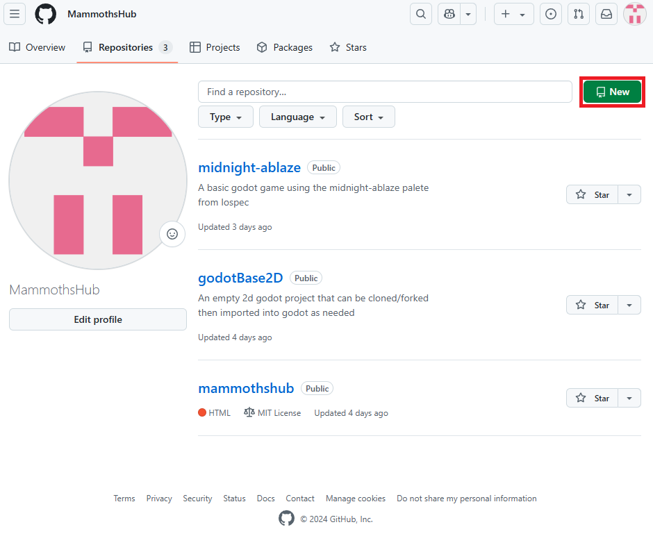
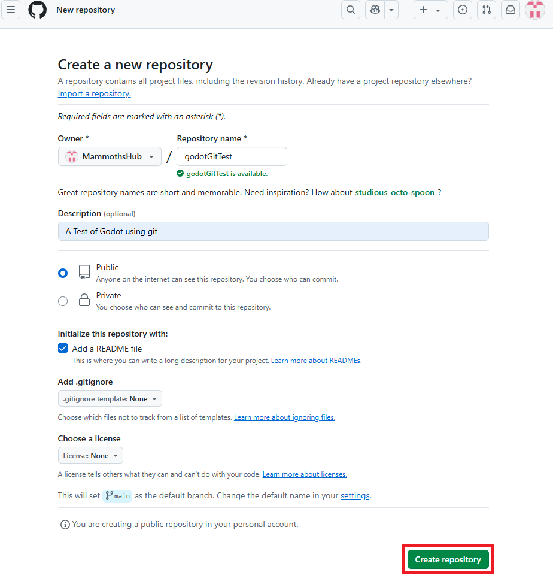
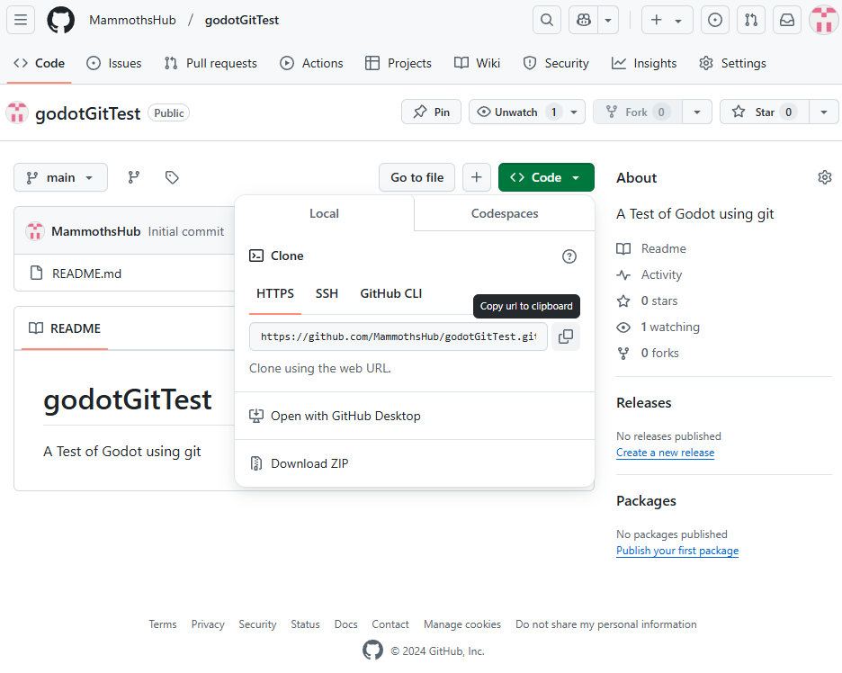
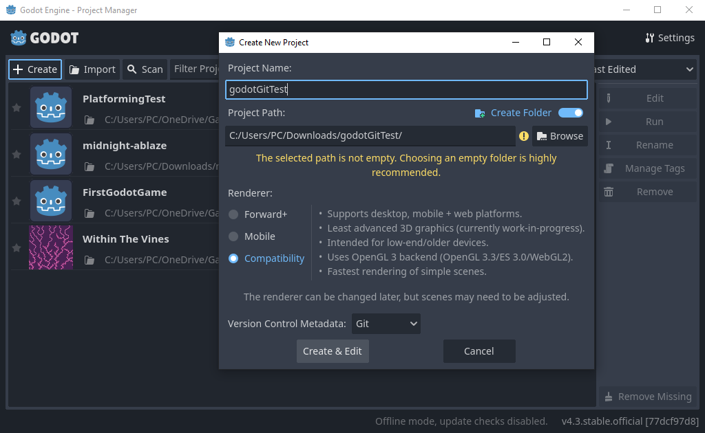
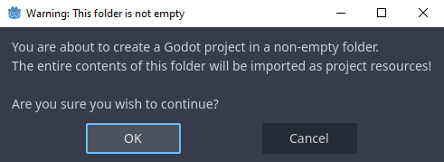
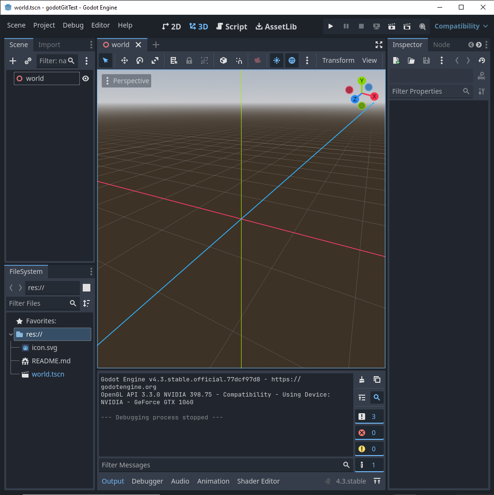
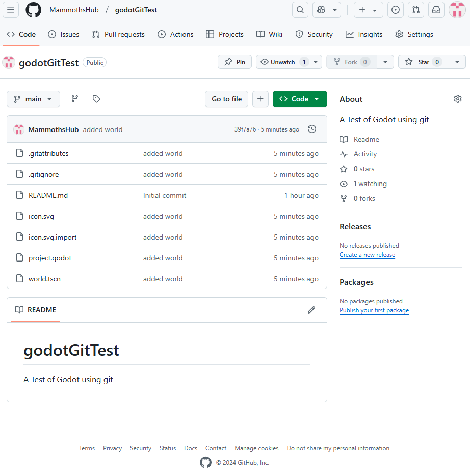

# Godot's "Support" For Git

Godot does *technically* support git version control. In the same way chocolate is *technically* a vegetable. Unlike an application like VScode which has git source control baked in as a core feature Godot does not. Instead Godot will simply ignore the relevant git directories (.git primarily) and will consider them differently from the other resources in the `res` directory.

Therefore, if you want to create a godot project that uses git you need to use the `terminal`, `vscode`, or the `github desktop` application.  

# Setting up a new repo 

Firstly let's create a new repo:
</br>
{ width="600" }
</br>

Well call it godotGitTest and initialize it with a `README` to make our lives easier 
</br>
{ width="600" }
</br>

That's all we need to do for now

# Cloning the repo 

Git will produce a link that we can clone via https which we will copy to clipboard: 
</br>
{ width="600" }
</br>

Then we'll go to powershell, change directory to Downloads and clone our new repo:
``` shell
cd .\Downloads\
git clone https://github.com/MammothsHub/godotGitTest.git
```

You should then see output like this:
``` shell
Cloning into 'godotGitTest'...
remote: Enumerating objects: 3, done.
remote: Counting objects: 100% (3/3), done.
remote: Total 3 (delta 0), reused 0 (delta 0), pack-reused 0 (from 0)
Receiving objects: 100% (3/3), done.
```

# Opening The Repo In Godot 

We will then Open the Godot engine and hit the create button. Afterwards we will attempt to open a new godot project in the git repo we just cloned. You will see yellow warning text ignore this!:
</br>
{ width="600" }
</br>

When we hit create and edit Godot will again try to stop you. Once again ignore this and hit ok.
</br>
{ width="600" }
</br>

# Adding Features and Pushing to Git

We add a new scene called `world.tscn` to our project. 2D or 3D node, your choice, and save to our project:
</br>
{ width="600" }
</br>

Head back to the git repo in the terminal and go into the :
``` shell
cd Downloads\godotGitTest 
```

Then we can add commit and push as we would for any other normal git repo: 
``` shell
git add **
git commit -a 
git push
```
Just remember to have your editor set for the `commit` and to type a commit message. 

Then we can head back to our git repo where those changes have taken effect: 
</br>
{ width="600" }
</br>
Hoary! Now we've got a git repo that will update all of our changes! 
